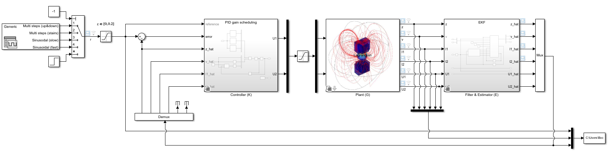

# Welcome :mortar_board:!

This organization gathers the complete set of software projects, simulations, and programming assignments that I developed throughout my academic journey in **Mechanical Engineering (BSc)** and **Mechatronics & Robotics Engineering (MSc)**.
The repositories reflect the coursework I completed at **@Politecnico di Milano** and **@University of Waterloo** during my Erasmus exchange program.

The primary purpose of this collection is to serve as a comprehensive portfolio of my academic work, showcasing the practical applications of the concepts and skills I acquired during my studies.
Except for the `README` files – which provide context and explanations – the code is presented as it was originally written for each course assignment or project.

## What You’ll Find Here

Each repository corresponds to a course that might contain multiple projects, assignments, or reports.
In general, three main branches of topics are covered:

#### Engineering foundations:
- [Informatica B](https://github.com/bocchio-academic-projects/081369-Informatica-B)
- [Metodi analitici e numerici per l'ingegneria](https://github.com/bocchio-academic-projects/054361-Metodi-analitici-e-numerici-per-l-ingegneria)
- [Sperimentazione e Analisi dei Dati](https://github.com/bocchio-academic-projects/056921-Sperimentazione-e-Analisi-dei-Dati)

#### Mechanical Engineering:
- [Advanced Manufacturing Process B](https://github.com/bocchio-academic-projects/059168-Advanced-Manufacturing-Process-B)
- [Advanced Finite Element Methods](https://github.com/bocchio-academic-projects/ME621-Advanced-Finite-Element-Methods)*
- [Computational Fluid Dynamics](https://github.com/bocchio-academic-projects/ME663-Computational-Fluid-Dynamics)*
- [Special Topics in Materials](https://github.com/bocchio-academic-projects/ME738-Special-Topics-in-Materials)*
- [Advanced Dynamics of Mechanical Systems](https://github.com/bocchio-academic-projects/059230-Advanced-Dynamics-of-Mechanical-Systems)
- [Topology Optimisation](https://github.com/bocchio-academic-projects/059257-Topology-Optimisation)

#### Mechatronics & Robotics:
- [Data Analysis and Experimental Characterization for Mechatronic and Robotic Systems](https://github.com/bocchio-academic-projects/059182-Data-Analysis-and-Experimental-Characterization-for-Mechatronic-and-Robotic-Systems)
- [Lab Mechatronics](https://github.com/bocchio-academic-projects/062020-Lab-Mechatronics)
- [Mechatronic Systems A](https://github.com/bocchio-academic-projects/062114-Mechatronic-Systems-A)
- [Machine Learning](https://github.com/bocchio-academic-projects/097683-Machine-Learning)

*Courses marked with an asterisk were taken at the University of Waterloo during my Erasmus exchange program.*

## Stack & Tools

Most projects are developed in `MATLAB`, given its widespread use in engineering coursework.
You will also find:

- `Simulink`, for system modeling and simulation
- `Python`, for data analysis, simulations, and robotics (NumPy, SciPy, ROS, etc.)
- Occasional `Mathematica` scripts for symbolic or analytical computations
- Reports and documentation written in `LaTeX`, ensuring clear and professional formatting

## Contributions & Usage

I believe in open knowledge sharing — feel free to explore, fork, or adapt these repositories for your own learning.
Keep in mind, however, that simply copying code is not enough; understanding the underlying concepts is essential for meaningful learning.
Use these projects as a reference or inspiration, not as a substitute for your own work.

If you find a project particularly useful or would like to contribute improvements, feel free to open an issue or reach out.

Have a nice coding day,

Tommaso :panda_face: